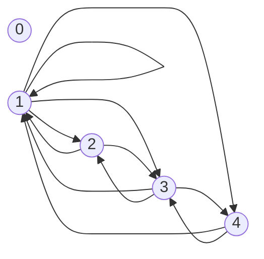

# Cartesian Product

**Cartesian Product** or cross product of two non-empty sets $A$ and $B$ expressed as $A\times B$ is a set of all ordered pairs $(a,b)$, where $a\in A$, $b\in B$.

Mathematically it can be written as:

$$
A\times B=\{(a,b)|a\in A,b\in B\}
$$

E.g.: Considering $A=\{1,2\}$, $B=\{a,b,c\}$. Then the Cartesian Product is, $A\times B=\{(1,a),(1,b),(1,c),(2,a),(2,b),(2,c)\}$.

_Figure 1: Relation map for $A\times B$:_

# Binary Relation

Let $A$ and $B$ be two non-empty sets. A binary relation $R$ is a subset of $A\times B$, _i.e._, $R\subseteq A\times B$. If $(a,b)\in R$, then it is written as $aRb$.

Considering $A=\{1,2,3\}$, $B=\{a,b\}$, then $R$ could be, $R=\{(1,a),(1,b),(3,b)\}$.

_Figure 2: Relation map for $aRb$:_

#### Example 1: Let $A=\{2,3,4,5,6\}$. Define a relation $aRb$ such that $a$ divides $b$.

Given, $A=\{2,3,4,5,6\}$. The relation $aRb$, such that $a$ divides $b$ is:

$$
aRb=\{(2,2),(2,4),(2,6),(3,3),(3,6),(4,4),(5,5),(6,6)\}
$$

#### Example 2: Let $A=\{0,1,2,3,4\}$. Define a relation $aRb$ such that $a+b=4$.

Given, $A=\{0,1,2,3,4\}$. The relation $aRb$ such that, $a+b=4$, is:

$$
aRb=\{(0,4),(1,3),(2,2),(3,1),(4,0)\}
$$

# Matrix of a relation

The matrix of a relation $A\times B$, where $A$ has $n$ elements, and $B$ has $m$ elements, is an $n\times m$ matrix, $M_R$ defined as follows:

$$
M_R=[m_{ij}]
$$

It can be perceived that:

$m_{ij}=1$, if $(a_i,b_j)\in R$, and

$m_{ij}=0$, if $(a_i,b_j)\notin R$.

E.g.: Considering $A=\{1,2,3\}$, $B=\{a,b,c,d\}$, and $aRb=\{(1,a),(2,a),(3,b),(3,d)\}$. Then their matrix, $M_R$ is:

$$
M_R={\begin{bmatrix}
1&0&0&0\\
1&0&0&0\\
0&1&0&1\\
\end{bmatrix}}
$$

> While drawing matrix, the first element in the relation is taken as the row, and the second element is taken as the column.

# Di-graph

Di-graph stands for _directed graph_. It is used to map out the relation between elements of sets. Considering a relation $aRb=\{(1,a),(2,a),(3,b),(3,d)\}$, we have the following di-graph, for it:

#### Example 3: Let $A=\{0,1,2,3,4\}$. Define a relation $aRb$, such that $a+b=4$. Define its relation matrix and draw its di-graph.

For the set $A=\{0,1,2,3,4\}$, we have a relation such that $a+b=4$. Therefore we have, $aRb=\{(0,4),(1,3),(2,2),(3,1),(4,0)\}$. It's relation matrix $M_R$ is:

$$
M_R=
\begin{bmatrix}
0&0&0&0&1\\
0&0&0&1&0\\
0&0&1&0&0\\
0&1&0&0&0\\
1&0&0&0&0
\end{bmatrix}
$$

Di-graph for the above relation $aRb$ is:

#### Example 4: Let $A=\{0,1,2,3,4\}$. Define a relation $aRb$ such that HCF of $(a,b)$ is $1$.

Given, $A=\{0,1,2,3,4\}$. A relation, $aRb$, such that HCF of $(a,b)$ is $1$, is:

$$
aRb=\{(1,1),(1,2),(1,3),(1,4),(2,1),(2,3),(3,1),(3,2),(3,4),(4,1),(4,3)\}
$$

$$
M_R=
\begin{bmatrix}
0&0&0&0&0\\
0&1&1&1&1\\
0&1&0&1&0\\
0&1&1&0&1\\
0&1&0&1&0
\end{bmatrix}
$$

# Properties of Relations

1. **Reflexive:** There should be $aRa$ for all $a\in A$.

2. **Symmetric:** If $aRb$ exists then $bRa$ should also exist for all $(a,b)\in A$.

3. **Antisymmetric:** If $aRb$ exists, then $bRa$ must not exist, but $bRa$ can exist if $a=b$ and $(a,b)\in A$.

4. **Asymmetric:** If $aRb$ exist, then $bRa$ must not exist for all $(a,b)\in A$,

5. **Transitive:** If $aRb$ and $bRc$ exists, then $aRc$ must exist where, $(a,b,c)\in A$.

# Equivalence Relation

A binary relation $R$ on set $A$ is called an equivalence relation if $R$ is **reflexive**, **symmetric** and **transitive**.

E.g. Let $A=\{1,2,3\}$ and $R=\{(1,1),(1,2),(2,1),(2,2),(3,2)\}$. To check whether $R$ is reflexive or not, the following conditions must hold true:

$$
M_R=
\begin{bmatrix}
1&1&0\\
1&1&0\\
0&0&1
\end{bmatrix}
$$

**Test for reflexive**:

Since, all elements in the right bearing diagonal are $1$, therefore, the relation is reflexive.

**Test for symmetric**:

$$
M_R^{-1}=
\begin{bmatrix}
1&1&0\\
1&1&0\\
0&0&1
\end{bmatrix}
$$

Since, $M_R^{-1}=M_R$, therefore, the relation is symmetric.

**Test for transitive**:

$$
(M_R)^2_\odot=
\begin{bmatrix}
1&1&0\\
1&1&0\\
0&0&1
\end{bmatrix}
\begin{bmatrix}
1&1&0\\
1&1&0\\
0&0&1
\end{bmatrix}
=\begin{bmatrix}
1&1&0\\
1&1&0\\
0&0&1
\end{bmatrix}
$$

Since, $(M_R)^2_\odot=M_R$, therefore, the relation is transitive.

Since the relation $R$, is reflexive, symmetric and transitive, therefore, it is an equivalence relation.

#### Example 5: Let, $A={1,2,3}$, and $R=\{(1,1),(2,2),(2,3),(3,2),(3,3)\}$. Find out if $R$ is an equivalence relation or not.

For $R$ to be an equivalence relation, it must be reflexive, symmetric and transitive.

The matrix for $R$, $M_R$ is:

$$
M_R=
\begin{bmatrix}
1&0&0\\
0&1&1\\
0&1&1
\end{bmatrix}
$$

**Test for reflexive**:

Since all the right bearing diagonals are $1$, therefore, the relation is reflexive.

**Test for symmetric**:

$$
M_R^{-1}=
\begin{bmatrix}
1&0&0\\
0&1&1\\
0&1&1
\end{bmatrix}
$$

Since, $M_R^{-1}=M_R$, therefore, the relation is symmetric.

**Test for transitive**:

$$
(M_R)^2_\odot=
M_R=
\begin{bmatrix}
1&0&0\\
0&1&1\\
0&1&1
\end{bmatrix}
\begin{bmatrix}
1&0&0\\
0&1&1\\
0&1&1
\end{bmatrix}
=
\begin{bmatrix}
1&0&0\\
0&1&1\\
0&1&1
\end{bmatrix}
$$

Since, $(M_R)^2_\odot=M_R$, therefore, the relation is transitive.

Since the relation R, is reflexive, symmetric and transitive, therefore, it is an equivalence relation.

# Closure

Certain elements added to the relation set to make it obey properties like reflexive, symmetry etc., is known as a relation closure.

E.g.: $A=\{0,1,2,3\}$, and $R=\{(0,1),(1,1),(1,2),(2,0),(2,2),(3,0)\}$.

Matrix of the relation, $M_R$ is:

$$
M_R=
\begin{bmatrix}
0&1&0&0\\
0&1&1&0\\
1&0&1&0\\
1&0&0&0
\end{bmatrix}
$$

## Reflexive closure:

In order for $R$ to be reflexive, all right-bearing diagonal elements should be $1$. If $(0,0)$ and $(3,3)$ is added, the relation will be reflexive. Therefore reflexive closure $R'$, is:

$$
R'=\{(0,1),(1,1),(1,2),(2,0),(2,2),(3,0),(0,0),(3,3)\}
$$

## Symmetric closure:

To find the symmetric closure, we derive $R^{-1}$, and perform $R\cup R^{-1}$.

$$
R^{-1}=\{(1,0),(1,1),(2,1),(0,2),(2,2),(0,3)\}
$$

Therefore, symmetric closure, $R'$, is:

$$
R'=R\cup R^{-1}=\{(0,1),(1,1),(1,2),(2,0),(2,2),(3,0),(1,0),(2,1),(0,2),(0,3)\}
$$

## Transitive closure:

Transitive closure is performed using _Warshall's Algorithm_.

Considerin a set $A=\{1,2,3,4\}$, and $R=\{(2,1),(2,3),(3,1),(3,4),(4,1),(4,3)\}$. Then, its matrix is:

$$
M_R=
\begin{bmatrix}
0&0&0&0\\
1&0&1&0\\
1&0&0&1\\
1&0&1&0
\end{bmatrix}
$$

| C           | R          | C.P.                          |
| :---------- | ---------- | ----------------------------- |
| $\{2,3,4\}$ | $\{\phi\}$ | -                             |
| $\{\phi\}$  | $\{1,3\}$  | -                             |
| $\{2,4\}$   | $\{1,4\}$  | $\{(2,1),(2,4),(4,1),(4,4)\}$ |
| $\{3\}$     | $\{1,3\}$  | $\{(3,1),(3,3)\}$             |

$$
M_R'=
\begin{bmatrix}
0&0&0&0\\
1&0&1&1\\
1&0&1&1\\
1&0&1&1
\end{bmatrix}
$$

| C           | R           | C.P.                                                        |
| ----------- | ----------- | ----------------------------------------------------------- |
| $\{2,3,4\}$ | $\{\phi\}$  | -                                                           |
| $\{\phi\}$  | $\{1,3,4\}$ | -                                                           |
| $\{2,3,4\}$ | $\{1,3,4\}$ | $\{(2,1),(2,3),(2,4),(3,1),(3,3),(3,4),(4,1),(4,3),(4,4)\}$ |
| $\{2,3,4\}$ | $\{1,3,4\}$ | $\{(2,1),(2,3),(2,4),(3,1),(3,3),(3,4),(4,1),(4,3),(4,4)\}$ |

$$
M_R''=
\begin{bmatrix}
0&0&0&0\\
1&0&1&1\\
1&0&1&1\\
1&0&1&1
\end{bmatrix}
$$

Since, $M_R'=M_R''$, therefore, transitive closure, $R'$ is:

$$
R'=\{(2,1),(2,3),(2,4),(3,1),(3,3),(3,4),(4,1),(4,3),(4,4)\}
$$

#### Example 6: Given the set $A=\{a,b,c,d\}$, and $R=\{(a,d),(b,a),(b,c),(c,a),(c,d),(d,c)\}$.

It's matrix is:

$$
M_R=
\begin{bmatrix}
0&0&0&1\\
1&0&1&0\\
1&0&0&1\\
0&0&1&0
\end{bmatrix}
$$

| C          | R         | C.P.                          |
| ---------- | --------- | ----------------------------- |
| $\{b,c\}$  | $\{d\}$   | $\{(b,d),(c,d)\}$             |
| $\{\phi\}$ | $\{a,c\}$ | -                             |
| $\{b,d\}$  | $\{a,d\}$ | $\{(b,a),(b,d),(d,a),(d,d)\}$ |
| $\{a,c\}$  | $\{c\}$   | $\{(a,c),(c,c)\}$             |

$$
M_R'=
\begin{bmatrix}
0&0&1&1\\
1&0&1&1\\
1&0&1&1\\
1&0&1&1
\end{bmatrix}
$$

| C             | R           | C.P.                                                                          |
| ------------- | ----------- | ----------------------------------------------------------------------------- |
| $\{b,c,d\}$   | $\{c,d\}$   | $\{(b,c),(b,d),(c,c),(c,d),(d,c),(d,d)\}$                                     |
| $\{\phi\}$    | $\{a,c,d\}$ | -                                                                             |
| $\{a,b,c,d\}$ | $\{a,c,d\}$ | $\{(a,a),(a,c),(a,d),(b,a),(b,c),(b,d),(c,a),(c,c),(c,d),(d,a),(d,c),(d,d)\}$ |
| $\{a,b,c,d\}$ | $\{a,c,d\}$ | $\{(a,a),(a,c),(a,d),(b,a),(b,c),(b,d),(c,a),(c,c),(c,d),(d,a),(d,c),(d,d)\}$ |

$$
M_R''=
\begin{bmatrix}
1&0&1&1\\
1&0&1&1\\
1&0&1&1\\
1&0&1&1
\end{bmatrix}
$$

| C             | R           | C.P.                                                                          |
| ------------- | ----------- | ----------------------------------------------------------------------------- |
| $\{a,b,c,d\}$ | $\{a,c,d\}$ | $\{(a,a),(a,c),(a,d),(b,a),(b,c),(b,d),(c,a),(c,c),(c,d),(d,a),(d,c),(d,d)\}$ |
| $\{\phi\}$    | $\{a,c,d\}$ | -                                                                             |
| $\{a,b,c,d\}$ | $\{a,c,d\}$ | $\{(a,a),(a,c),(a,d),(b,a),(b,c),(b,d),(c,a),(c,c),(c,d),(d,a),(d,c),(d,d)\}$ |
| $\{a,b,c,d\}$ | $\{a,c,d\}$ | $\{(a,a),(a,c),(a,d),(b,a),(b,c),(b,d),(c,a),(c,c),(c,d),(d,a),(d,c),(d,d)\}$ |

$$
M_R'''=
\begin{bmatrix}
1&0&1&1\\
1&0&1&1\\
1&0&1&1\\
1&0&1&1
\end{bmatrix}
$$

Since, $M_R''=M_R'''$, therefore, transitive closure, $R'$ is achieved.

$$
R'=\{(a,a),(a,c),(a,d),(b,a),(b,c),(b,d),(c,a),(c,c),(c,d),(d,a),(d,c),(d,d)\}
$$

# Equivalence of class and partition

The general equation for equivalent classes:

$$
[x]=\{y|y\in A,(x,y)\in R\}
$$

E.g.: $A=\{1,2,3,4,5\}$, and $R=\{(1,1),(2,2),(3,3),(4,4),(5,5),(1,2),(2,1),(4,5),(5,4)\}$

$$
[1]=\{1,2\}, [2]=\{2,1\}, [3]=\{3\}, [4]=\{4,5\}, [5]=\{5,4\}
$$

Therefore, the partitions are:

$P_1=\{1,2\}$, $P_2=\{3\}$, $P_3=\{4,5\}$

From the above, it can be drawn out that:

$$
P_1\cup P_2\cup P_3=A
$$

$$
P_1\cap P_2\cap P_3 = \{\phi\}
$$

#### Example 7: $A=\{1,2,3\}$, and $R=\{(1,1),(1,2),(2,1),(2,2),(3,3)\}$.

Equivalence classes:

$$
[1]=\{1.2\}, [2]=\{2,1\}, [3]=\{3\}
$$

Partitions are:

$P_1=\{1,2\}$, $P_2=\{3\}$

#### Example 8: Let set $A=\{1,2,3,4,5,6\}$, $P_1=\{1,3,5\}$, $P_2=\{2,4,6\}$, where $P_1$, and $P_2$ are partitions. Find the relation set of the set $A$.

$R$ could be found by the union of the Cartesian products of the two partitions.

$$
R=\{(1,1),(1,3),(1,5),(3,1),(3,3),(3,5),(5,1),(5,3),(5,5),\\(2,2),(2,4),(2,6),(4,2),(4,4),(4,6),(6,2),(6,4),(6,6)\}
$$

# POSET

POSET stands for **partial-order set**. Let $R$ be a relation on set $A$. The relation $R$ is called partial order set (POSET), if $R$ is reflexive, antisymmetric, and transitive. A POSET is symbolically represented as $(A,\le)$.

E.g.: Let a set be $A=\{1,2,3,4\}$, and its relation set be defined by $R=\{(a,b)|(a,b)\in A, a\ge b\}$.

$$
R=\{(1,1),(2,1),(2,2),(3,1),(3,2),(3,3),(4,1),(4,2),(4,3),(4,4)\}
$$

It's relation matrix is:

$$
M_R=
\begin{bmatrix}
1&0&0&0\\
1&1&0&0\\
1&1&1&0\\
1&1&1&1
\end{bmatrix}
$$

**Check for reflexive**:

Since all diagonal elements are $1$, therefore the relation is reflexive.

**Check for antisymmetric**:

For all non-diagonal elements, $[m_{ij}]=1$, $[m_{j,i}=0]$, hence it is antisymmetric.

**Check for transitive**:

$$
(M_R)^2_\odot=
\begin{bmatrix}
1&0&0&0\\
1&1&0&0\\
1&1&1&0\\
1&1&1&1
\end{bmatrix}
\begin{bmatrix}
1&0&0&0\\
1&1&0&0\\
1&1&1&0\\
1&1&1&1
\end{bmatrix}
=
\begin{bmatrix}
1&0&0&0\\
1&1&0&0\\
1&1&1&0\\
1&1&1&1
\end{bmatrix}
$$

Since, $(M_R)^2_\odot=M_R$, therefore the relation is transitive.

Since the relation is reflexive, antisymmetric, and transitive, therefore the relation is a POSET.
