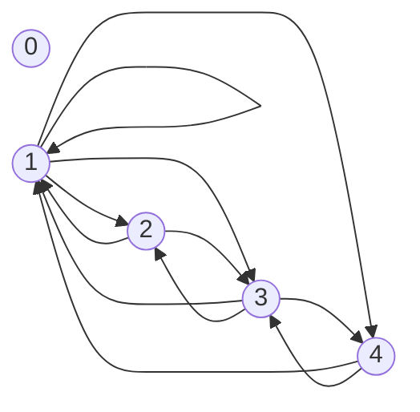

# Cartesian Product

**Cartesian Product** or cross product of two non-empty sets $A$ and $B$ expressed as $A\times B$ is a set of all ordered pairs $(a,b)$, where $a\in A$, $b\in B$.

Mathematically it can be written as:

$$
A\times B=\{(a,b)|a\in A,b\in B\}
$$

E.g.: Considering $A=\{1,2\}$, $B=\{a,b,c\}$. Then the Cartesian Product is, $A\times B=\{(1,a),(1,b),(1,c),(2,a),(2,b),(2,c)\}$.

_Figure 1: Relation map for $A\times B$:_

# Binary Relation

Let $A$ and $B$ be two non-empty sets. A binary relation $R$ is a subset of $A\times B$, _i.e._, $R\subseteq A\times B$. If $(a,b)\in R$, then it is written as $aRb$.

Considering $A=\{1,2,3\}$, $B=\{a,b\}$, then $R$ could be, $R=\{(1,a),(1,b),(3,b)\}$.

_Figure 2: Relation map for $aRb$:_

#### Example 1: Let $A=\{2,3,4,5,6\}$. Define a relation $aRb$ such that $a$ divides $b$.

Given, $A=\{2,3,4,5,6\}$. The relation $aRb$, such that $a$ divides $b$ is:

$$
aRb=\{(2,2),(2,4),(2,6),(3,3),(3,6),(4,4),(5,5),(6,6)\}
$$

#### Example 2: Let $A=\{0,1,2,3,4\}$. Define a relation $aRb$ such that $a+b=4$.

Given, $A=\{0,1,2,3,4\}$. The relation $aRb$ such that, $a+b=4$, is:

$$
aRb=\{(0,4),(1,3),(2,2),(3,1),(4,0)\}
$$

# Matrix of a relation

The matrix of a relation $A\times B$, where $A$ has $n$ elements, and $B$ has $m$ elements, is an $n\times m$ matrix, $M_R$ defined as follows:

$$
M_R=[m_{ij}]
$$

It can be perceived that:

$m_{ij}=1$, if $(a_i,b_j)\in R$, and

$m_{ij}=0$, if $(a_i,b_j)\notin R$.

E.g.: Considering $A=\{1,2,3\}$, $B=\{a,b,c,d\}$, and $aRb=\{(1,a),(2,a),(3,b),(3,d)\}$. Then their matrix, $M_R$ is:

$$
M_R={\begin{bmatrix}
1&0&0&0\\
1&0&0&0\\
0&1&0&1\\
\end{bmatrix}}
$$

> While drawing matrix, the first element in the relation is taken as the row, and the second element is taken as the column.

# Di-graph

Di-graph stands for _directed graph_. It is used to map out the relation between elements of sets. Considering a relation $aRb=\{(1,a),(2,a),(3,b),(3,d)\}$, we have the following di-graph, for it:

#### Example 3: Let $A=\{0,1,2,3,4\}$. Define a relation $aRb$, such that $a+b=4$. Define its relation matrix and draw its di-graph.

For the set $A=\{0,1,2,3,4\}$, we have a relation such that $a+b=4$. Therefore we have, $aRb=\{(0,4),(1,3),(2,2),(3,1),(4,0)\}$. It's relation matrix $M_R$ is:

$$
M_R=
\begin{bmatrix}
0&0&0&0&1\\
0&0&0&1&0\\
0&0&1&0&0\\
0&1&0&0&0\\
1&0&0&0&0
\end{bmatrix}
$$

Di-graph for the above relation $aRb$ is:

#### Example 4: Let $A=\{0,1,2,3,4\}$. Define a relation $aRb$ such that HCF of $(a,b)$ is $1$.

Given, $A=\{0,1,2,3,4\}$. A relation, $aRb$, such that HCF of $(a,b)$ is $1$, is:

$$
aRb=\{(1,1),(1,2),(1,3),(1,4),(2,1),(2,3),(3,1),(3,2),(3,4),(4,1),(4,3)\}
$$

$$
M_R=
\begin{bmatrix}
0&0&0&0&0\\
0&1&1&1&1\\
0&1&0&1&0\\
0&1&1&0&1\\
0&1&0&1&0
\end{bmatrix}
$$

# Properties of relation

### Reflexive
